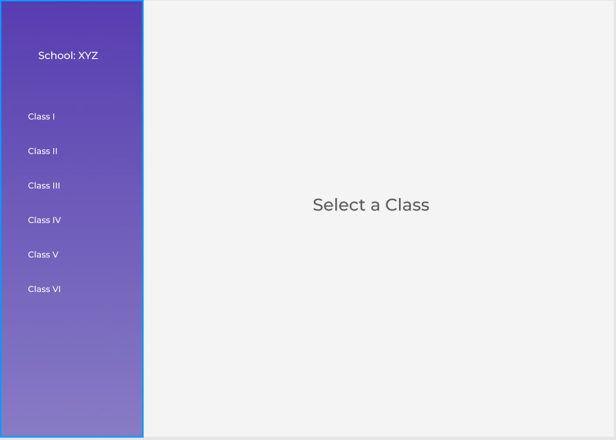
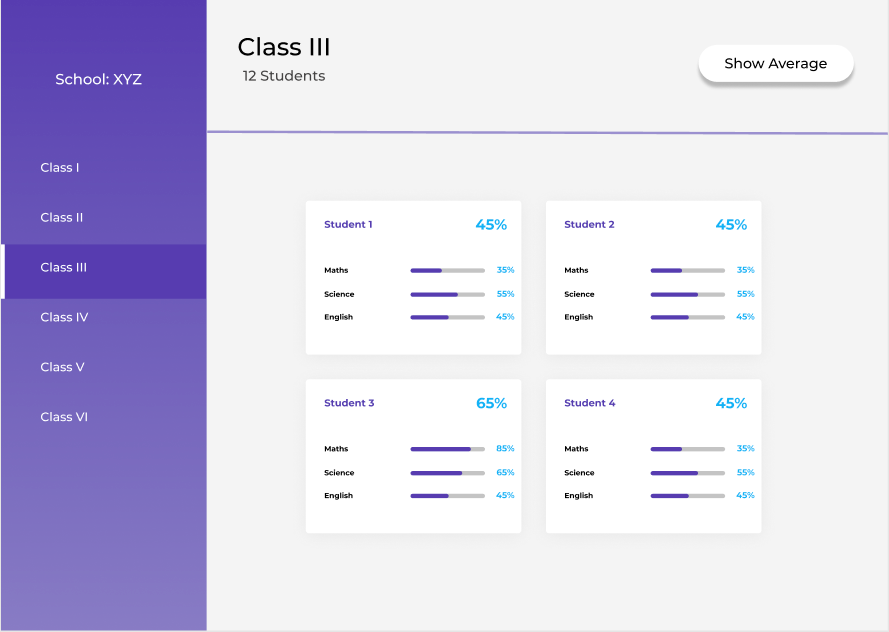
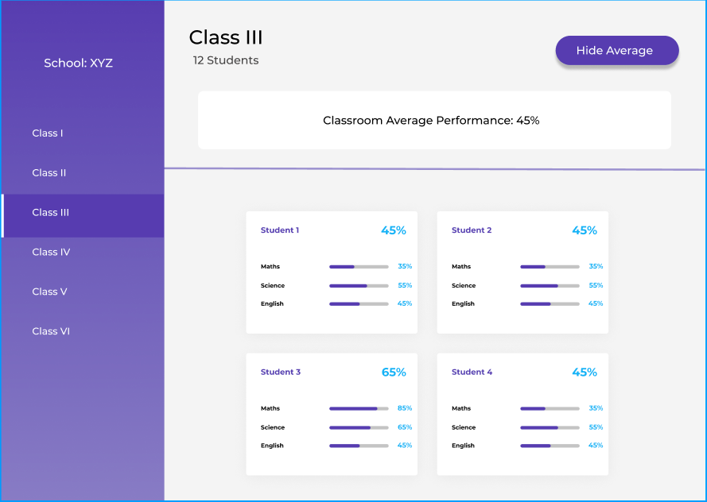

## Assignment Scaffolding

***Code Navigation***

This project consists of a main folder `src` which contains all the project files. `images` folder inside `src` contains the view of the page that is expected.

There are three components `Layout`, `SidePanel` and `MainPanel` where you have to write all the logic.

***Your Assignment***

You have to achieve three major tasks:

    use data from `classroom_data.json` to render the respective details as shown in screens.
    Split the logic in respective Components.
    Split the CSS in respective Components to keep them modular.

Go through the structure of the project and figure out how you would proceed.

***User Flow***

1. User Lands on the first view where no classRoom is selected


2. Clicking on a Class User can see the full view of that class


3. Clicking on a 'Show Average' can see the Average of marks of all students in that class


## Data

```json
  [
    {
      "classname": "Class I",
      "students": [
        {
          "name": "student 1",
          "marks": {
            "Maths": 35,
            "Science": 64,
            "English": 42
          }
        },
        {
          "name": "student 2",
          "marks": {
            "Maths": 20,
            "Science": 100,
            "English": 62
          }
        },
        {
          "name": "student 3",
          "marks": {
            "Maths": 60,
            "Science": 90,
            "English": 62
          }
        }
      ]
    }
    ...
  ]
```


## Available Scripts

In the project directory, you can run:

### `npm start`

Runs the app in the development mode.
Open [http://localhost:3000](http://localhost:3000) to view it in the browser.

The page will reload if you make edits.
You will also see any lint errors in the console.
